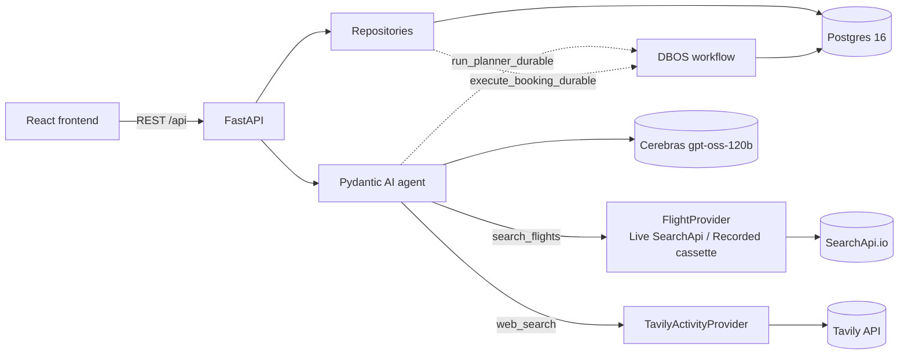

# Architecture

## System overview



The backend is a single FastAPI process. The frontend is a separate static SPA that talks to it
over REST; there is no server-rendered coupling between them.

## APIs & AI protocols

**External APIs** (all free tier):

| API | Role | Adapter |
|---|---|---|
| Cerebras (`gpt-oss-120b`) | The planner LLM — reasoning, tool selection, structured output. | Pydantic AI `CerebrasModel`/`CerebrasProvider` in `planner.py`. |
| SearchApi.io Google Flights | Real flight offers + booking options. | `flights_searchapi.py` (Live vs Recorded strategy). |
| Tavily | Real, source-attributed activity research. | `activities_tavily.py`. |

**AI protocols / Pydantic AI features used:**

- **Union structured output** — `output_type=[ItineraryOut, ClarificationOut]`. The model returns
  a validated itinerary *or* clarifying questions; "ask, don't assume" is a type, not a hope.
- **Tool calling (ReAct loop)** — two read-only tools, `search_flights` and `web_search`. The
  agent decides when to call them; results feed back into the loop.
- **Usage limits** — `UsageLimits(tool_calls_limit=MAX_TOOL_STEPS, total_tokens_limit=MAX_CONTEXT_TOKENS)`
  bound the loop so it can't spin or blow the context budget.
- **Prompt-injection guardrail** — `sanitize_web_content` wraps untrusted Tavily text in a delimited,
  escaped block before it reaches the prompt, so embedded instructions read as data.
- **Fail-closed tool gate** — every tool is registered with a classification; today the only
  classification is `READ_ONLY`, and registering a tool without one raises `TypeError` at import.
  Guards against a write tool ever being wired into the agent without deliberately adding a new
  classification for it.
- **Durable steps (DBOS)** — the planner run and booking execute are checkpointed workflows that
  resume after a crash.
- **Observability** — `AgentRun`/`AgentRunStep` rows are derived from the real message history and
  usage, powering the execution panel.
- **Eval scoring (`pydantic-evals`)** — deterministic evaluators (output-type, citation grounding)
  plus an `LLMJudge` for fitness-appropriateness. See `backend/evals/`.

## Request/agent flow

**Planning a trip** (`POST /api/trips/{id}/plan`):

1. `routes/trips.py::plan_trip` calls `repositories/trips_repository.py::get_or_create_itinerary`.
2. If an `Itinerary` row already exists for the trip, it's returned as-is — `/plan` is idempotent
   per trip (`UniqueConstraint(trip_request_id)` on `Itinerary`).
3. Otherwise the repository calls `run_planner_durable(trip_id, prompt)`
   (`app/dbos_runtime.py`), which first acquires a slot from the in-process concurrency limiter
   (`app/rate_limit.py::acquire_agent_run_slot`, caps concurrent real LLM calls at
   `MAX_CONCURRENT_AGENT_RUNS`), then invokes the actual `@DBOS.workflow`-wrapped planner run.
4. Inside the workflow: an `execution_context` is opened (binds a `trip_request_id` so every
   tool call downstream can call `record_event` without threading an ID through every
   signature), then `agent.iter(...)` drives the real Pydantic AI agent — a ReAct-style,
   node-by-node async iteration loop over `search_flights` and `web_search`, capped by
   `MAX_TOOL_STEPS` / `MAX_CONTEXT_TOKENS` (`UsageLimits`, see `default_usage_limits()`).
5. The agent's `output_type` is a union: `ItineraryOut | ClarificationOut`. The model resolves
   to whichever is appropriate — a `ClarificationOut` is returned to the client as a set of
   questions and **nothing is persisted**; an `ItineraryOut` is persisted (`Itinerary` row,
   trip status moves to `ITINERARY_READY`).
6. Every tool call records an `ExecutionEvent` (`execution_log.py`); at the end of the run,
   `observability.py::persist_agent_run` derives an `AgentRun` + ordered `AgentRunStep` rows
   from the real `result.all_messages()` and `result.usage` — never fabricated, a missing field
   is left null rather than guessed.
7. The concurrency slot is released (`try`/`finally`, outside the DBOS-wrapped call — see
   [DECISIONS.md](DECISIONS.md) for why that placement matters).

**Booking a flight** (the HITL gate): a REST state machine, not an agent capability. See
"HITL booking" below.

**Watching a run**: `GET /api/trips/{id}/execution` reads back the latest `AgentRun` + its
`AgentRunStep`s + the trip's full `ExecutionEvent` timeline, shaped into `ExecutionPanelOut`
(`routes/trips.py::_to_panel_out`) with a derived `budget_utilization_pct` (tokens used ÷
`MAX_CONTEXT_TOKENS`) and an `estimated_cost_usd` (labeled "actual $0 — free tier" in the UI).

## Data model

Nine tables, five core + four audit/observability (`app/models.py`):

| Table | Purpose |
|---|---|
| `user_account` | One fixed demo user today; `get_current_user` (`dependencies.py`) is the single seam real auth would touch. |
| `trip_request` | The traveler's inputs + `status` (`created` → `flights_searched` → `itinerary_ready`). |
| `flight_search_result` | Normalized offers from a search; `source` distinguishes `live` from `cached`. |
| `itinerary` | One row per trip (unique constraint); `days` is the full structured itinerary JSON. |
| `hitl_booking_log` | The booking state machine's row: `state`, `expires_at`, `booking_reference`, `booking_options`. |
| `booking_transition` | **Append-only.** Every state change, with `from_state`/`to_state`/`reason`/`actor_user_id`. |
| `execution_event` | **Append-only.** Every API call / DB query / protocol / HITL step during a run, in order. |
| `agent_run` | One row per planner invocation: token totals, duration, status. |
| `agent_run_step` | One row per model call or tool call within a run, in order. |

`booking_transition` and `execution_event` are made physically append-only by a Postgres
trigger (`reject_audit_row_mutation()`, in the initial Alembic migration) — `UPDATE`/`DELETE`
raises at the database level regardless of what application code attempts.

## HITL booking (`app/state.py`)

```
PENDING_USER_CONFIRMATION ──confirm──► CONFIRMED ──execute──► EXECUTED
        │        │                          │  │
        │        └──────── cancel ──────────┘  │
        │                                       └─► CANCELLED
        └─────────── expire (TTL) ──────────────► EXPIRED   (also from CONFIRMED)
```

`ALLOWED_TRANSITIONS` is the single source of truth; any move not listed is rejected with a 409
and never reaches the database. `execute_booking` is the highest-value guard in the system: it
claims the row with `SELECT ... FOR UPDATE`, re-checks state under that lock, and fetches
booking options exactly once — a double-click from an impatient human can never double-book or
burn a second unit of the flight-search quota (see `test_double_execute_books_once`). This
entire state machine lives outside the agent; the agent can plan and search but has no tool that
can move a booking's state, so "a human must click confirm, then execute" is structural, not a
prompt instruction the model could be talked out of.

## Agent Execution Panel

Built for a technical reviewer to watch the agent work in real time (or after the fact): token
totals, context-budget utilization, tool-step count, estimated cost, duration, model, and status,
above the ordered step/event history. Backed entirely by real persisted data
(`agent_run`/`agent_run_step`/`execution_event`) — nothing in the panel is computed live from the
in-memory agent state, so it reflects exactly what happened, including runs from before the
current process started.

## Durable execution (DBOS)

Two flows are wrapped as `@DBOS.workflow`s so a process crash mid-run resumes rather than
silently losing state: `execute_booking_durable` (`app/dbos_runtime.py`) and the planner run
(`_run_planner_workflow`). DBOS reuses the app's own Postgres instance (its own `dbos` schema) —
no additional infrastructure. Because DBOS workflows must take only serializable arguments and
may replay their body during crash recovery, both durable entry points rebuild their
session/provider dependencies internally rather than receiving them injected, and neither
mutates plain in-process state (locks, counters) from inside the workflow body — see
[DECISIONS.md](DECISIONS.md) for the concurrency-limiter bug this constraint caused and how it
was fixed.
