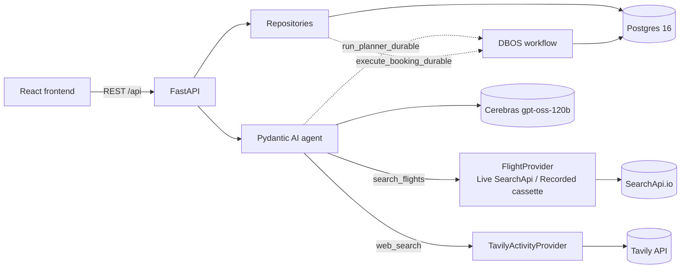
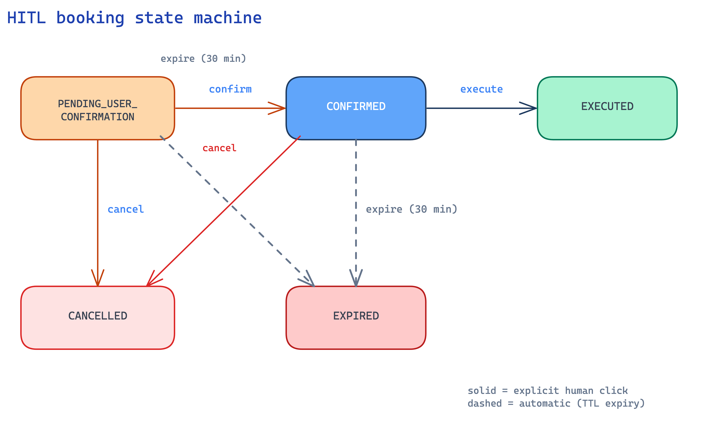

# Architecture

## System overview

The backend is a single FastAPI process. The frontend is a separate static SPA that talks to it
over REST; there is no server-rendered coupling between them.

## Requirements → implementation

- **Cheapest flights:** `trips_repository.py::_cheapest_first` sorts every offer ascending by
  `price_usd` on every path (fresh search, own-trip reuse, cross-trip cache) — a backend
  guarantee, not just provider ordering. The UI lists offers in that order, so the cheapest is
  always shown first.
- **Itinerary from a real API, tailored to age/fitness:** `web_search` (Tavily) grounds every
  activity in a real, cited source; `output_type=[ItineraryOut, ClarificationOut]` plus the
  `reject_unsafe_intensity` guardrail tie activity intensity to the traveler's fitness level.
- **Ask, don't assume:** genuinely ambiguous inputs (not missing ones — those are required at
  intake) produce a `ClarificationOut` instead of a guessed itinerary.
- **Visible UI:** React SPA with a live tool-call feed and an execution panel (see below).
- **HITL booking (bonus):** explicit confirm-then-execute clicks gate the only booking write;
  see "HITL booking" below for what "execute" does and doesn't do.

## APIs & AI protocols

**External APIs** (all free tier):

| API | Role | Adapter |
|---|---|---|
| Cerebras (`gpt-oss-120b`) | The planner LLM — reasoning, tool selection, structured output. | Pydantic AI `CerebrasModel`/`CerebrasProvider` in `planner.py`. |
| SearchApi.io Google Flights | Real flight offers + booking options. | `flights_searchapi.py` (Live vs Recorded strategy). |
| Tavily | Real, source-attributed activity research. | `activities_tavily.py`. |

**AI protocols:**

- **REST** between the React frontend and FastAPI backend.
- **LLM tool/function calling** — the model chooses when to call `search_flights` and
  `web_search`; results feed back into its context.
- **JSON Schema structured output** — Pydantic AI validates the model's output against
  `output_type=[ItineraryOut, ClarificationOut]`; "ask, don't assume" is a type, not a hope.
- **ReAct-style agent loop** — `agent.iter(...)` drives a reason → act (tool call) → observe
  cycle until the model resolves to a final structured output.

**Supporting engineering (not protocols, but load-bearing):**

- **Usage limits** — `UsageLimits(tool_calls_limit=MAX_TOOL_STEPS, total_tokens_limit=MAX_CONTEXT_TOKENS)`
  bounds the loop so it can't spin; `MAX_CONTEXT_TOKENS` matches gpt-oss-120b's real 30K
  tokens/minute limit on Cerebras. A run that exceeds it degrades to a clarifying question
  instead of crashing.
- **Prompt-injection guardrail** — `sanitize_web_content` wraps untrusted Tavily text in a delimited,
  escaped block before it reaches the prompt, so embedded instructions read as data.
- **Durable steps (DBOS)** — the planner run and booking execute are checkpointed workflows that
  resume after a crash.
- **Observability** — `AgentRun`/`AgentRunStep` rows are derived from the real message history and
  usage, powering the execution panel.
- **Eval scoring (`pydantic-evals`)** — deterministic evaluators (output-type, citation grounding)
  plus an `LLMJudge` for fitness-appropriateness. See `backend/evals/`.

## Request/agent flow

**Planning a trip** (`POST /api/trips/{id}/plan`): `plan_trip` is idempotent per trip
(`get_or_create_itinerary` returns an existing `Itinerary` row as-is). Otherwise it calls
`run_planner_durable` (`app/dbos_runtime.py`), which acquires a concurrency slot
(`acquire_agent_run_slot`, caps concurrent real LLM calls) and runs the `@DBOS.workflow`-wrapped
planner: `agent.iter(...)` drives a ReAct-style loop over `search_flights`/`web_search`, capped by
`MAX_TOOL_STEPS`/`MAX_CONTEXT_TOKENS`. The output resolves to the `ItineraryOut | ClarificationOut`
union — a `ClarificationOut` returns questions without persisting an itinerary; an `ItineraryOut`
persists and moves the trip to `ITINERARY_READY`. Every tool call records an `ExecutionEvent`, and
`persist_agent_run` derives `AgentRun`/`AgentRunStep` rows from the real message history and usage
(never fabricated). The concurrency slot releases in a `finally`, outside the DBOS-wrapped call —
see [DECISIONS.md](DECISIONS.md) for why that placement matters.

**Booking a flight** (the HITL gate): a REST state machine, not an agent capability. See
"HITL booking" below.

**Watching a run**: `GET /api/trips/{id}/execution` reads every `AgentRun` with its owned
`AgentRunStep`s and `ExecutionEvent`s, shaped into `ExecutionPanelOut` with derived context usage
and estimated cost. The response also retains the trip-wide event stream for LiveActivity; the
execution panel renders events only inside their owning run.

## Data model

Five core tables (`user_account`, `trip_request`, `flight_search_result`, `itinerary`,
`hitl_booking_log`) plus four audit/observability tables (`booking_transition`, `execution_event`,
`agent_run`, `agent_run_step`) in `app/models.py`. `booking_transition` and `execution_event` are
append-only, enforced by a Postgres trigger (`reject_audit_row_mutation()`) — `UPDATE`/`DELETE`
raises at the database level regardless of what application code attempts.

## HITL booking (`app/state.py`)

`ALLOWED_TRANSITIONS` is the single source of truth; any move not listed is rejected with a 409
and never reaches the database. `execute_booking` is the highest-value guard in the system: it
claims the row with `SELECT ... FOR UPDATE`, re-checks state under that lock, and fetches
booking options exactly once — a double-click from an impatient human can never trigger a second
`booking_options` fetch or burn a second unit of the flight-search quota (see
`test_double_execute_books_once`). This entire state machine lives outside the agent; the agent
can plan and search but has no tool that can move a booking's state, so "a human must click
confirm, then execute" is structural, not a prompt instruction the model could be talked out of.

**Scope note:** "execute" fetches real booking options from SearchApi and stamps an internal
`TA-*` reference on the `HITLBookingLog` row — it's a human-confirmed booking *handoff*, not a
real airline reservation/purchase (no PNR, no payment). Completing a real purchase is out of
scope for this take-home; see [DECISIONS.md](DECISIONS.md).

## Agent Execution Panel

Watch the agent work, live or after the fact: each run card combines metrics, model calls, tool
calls, and its own API/protocol activity. Backed entirely by real persisted data
(`agent_run`/`agent_run_step`/`execution_event`), not live in-memory state, so it reflects exactly
what happened — including runs from before the current process started.

## Durable execution (DBOS)

Two flows are wrapped as `@DBOS.workflow`s so a process crash mid-run resumes rather than
silently losing state: `execute_booking_durable` (`app/dbos_runtime.py`) and the planner run
(`_run_planner_workflow`). DBOS reuses the app's own Postgres instance (its own `dbos` schema) —
no additional infrastructure. Because DBOS workflows must take only serializable arguments and
may replay their body during crash recovery, both durable entry points rebuild their
session/provider dependencies internally rather than receiving them injected, and neither
mutates plain in-process state (locks, counters) from inside the workflow body — see
[DECISIONS.md](DECISIONS.md) for the concurrency-limiter bug this constraint caused and how it
was fixed.
